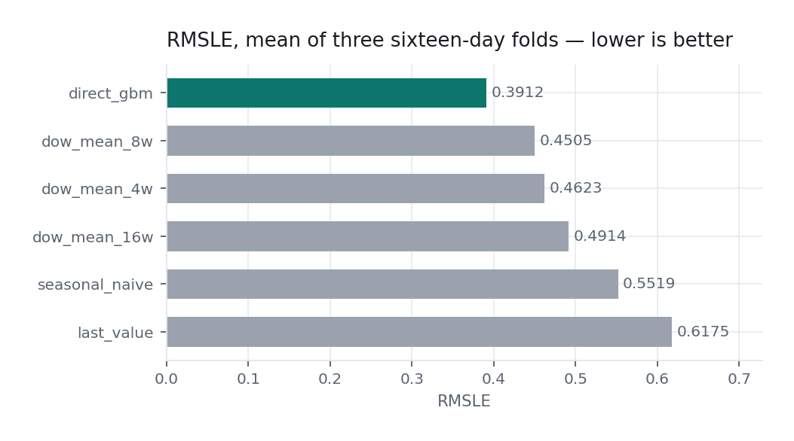
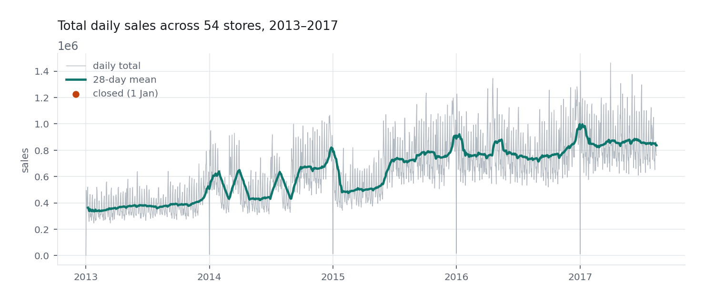
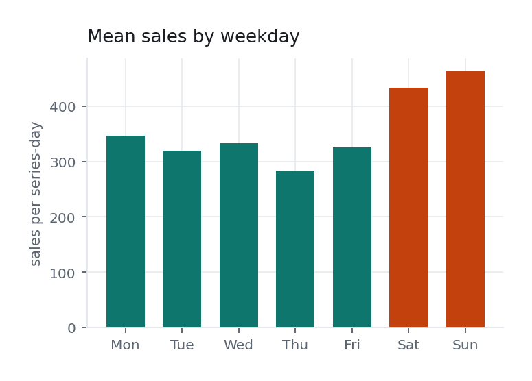
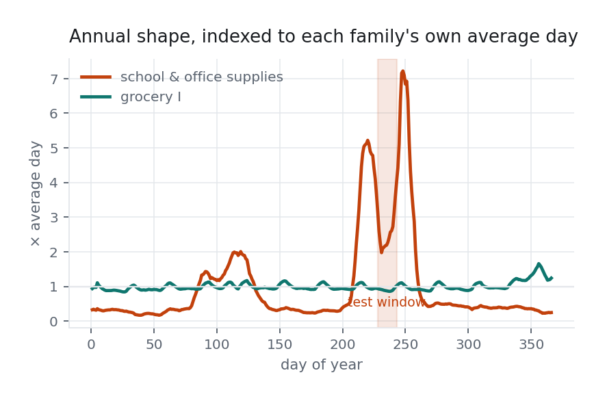
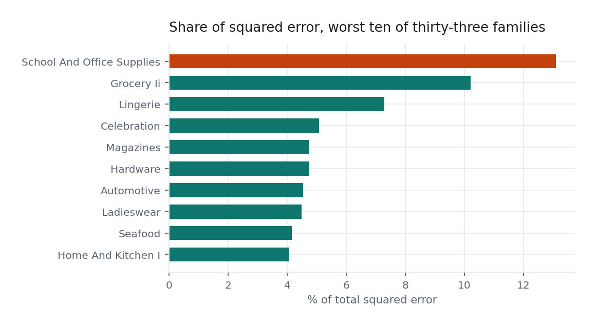

# Store Sales — Time Series Forecasting

[](https://github.com/conchocon154/store-sales-forecasting/actions/workflows/ci.yml)
[](LICENSE)

Sixteen days of daily sales for **1,782 series** — 54 Corporación Favorita
stores in Ecuador × 33 product families — forecast from four and a half years
of history. Scored on RMSLE.

| Model | 2017-06-29 | 2017-07-15 | 2017-07-31 | **mean RMSLE** |
|---|---:|---:|---:|---:|
| **direct GBM** | 0.3726 | 0.3881 | 0.4131 | **0.3912** |
| weekday mean, 8 weeks | 0.4059 | 0.4170 | 0.5286 | 0.4505 |
| weekday mean, 4 weeks | 0.4175 | 0.4295 | 0.5398 | 0.4623 |
| weekday mean, 16 weeks | 0.4870 | 0.4649 | 0.5224 | 0.4914 |
| seasonal naive (last week) | 0.5176 | 0.5212 | 0.6170 | 0.5519 |
| last value carried forward | 0.6051 | 0.5881 | 0.6595 | 0.6175 |
| predict zero | 4.4202 | 4.4193 | 4.4195 | 4.4197 |

Lower is better. Every row is measured the same way, on the same folds, with
the same dead-series rule applied — so the gap between them is the modelling
and not the protocol.

<picture>
  <source media="(prefers-color-scheme: dark)" srcset="reports/figures/model-ladder-dark.png">
  
</picture>

## What the series look like

<picture>
  <source media="(prefers-color-scheme: dark)" srcset="reports/figures/daily-sales-dark.png">
  
</picture>

Three things worth seeing before modelling anything. The level roughly doubles
over four and a half years, so a model with no trend term is low on the test
window by construction. The line drops to exactly zero every 1 January — the
shops are shut, which is a fact about the calendar and not a forecasting
problem. And the weekly shape is strong and regular, which is why a plain
weekday mean is such a hard baseline to beat.

<picture>
  <source media="(prefers-color-scheme: dark)" srcset="reports/figures/weekday-profile-dark.png">
  
</picture>

### The family that costs the most

<picture>
  <source media="(prefers-color-scheme: dark)" srcset="reports/figures/seasonal-index-dark.png">
  
</picture>

Indexed so two families of very different size read on one axis — 1.0 is each
family's own average day. Grocery sits flat on 1.0. School and office supplies
runs at about **0.35×** its own average through the quiet months and **2.6×** inside the sixteen days — a sevenfold swing whose peak, 7.2×, lands on day 248, just *after* the window closes, because Ecuadorean term
starts in August.

The window therefore catches the family mid-climb, between a peak and a trough,
swinging between 2.0× and 4.0× across sixteen days — which is harder to forecast
than the peak itself would be. That one family carries 13.1% of the squared
error on 3% of the rows, and this chart is why.

## Where this actually stands

| | RMSLE | rank of 642 |
|---|---:|---:|
| leaderboard best | 0.37294 | 1 |
| top 1% | 0.37715 | 7 |
| top 5% | 0.38369 | 33 |
| **this, submitted** | **0.40695** | **~92** |

**The honest headline is that the leaderboard has not moved.** Two submissions,
a plain gradient booster and a three-way blend with a substantially better
feature set, scored 0.40713 and 0.40695 — a difference of 0.0002 — while their
local scores on the fold immediately before the test period differ by 0.021
(0.42956 against 0.40892). Local improvement is real and measured; it is simply
not reaching the leaderboard, and until that is understood, more feature work is
guessing.

<picture>
  <source media="(prefers-color-scheme: dark)" srcset="reports/figures/error-by-horizon-dark.png">
  
</picture>

The most likely explanation is in the per-day error. Across a sixteen-day fold
the error climbs from about 0.40 on the first days to 0.46 on the last, because
every model is doing the same easy thing early and diverging later. If the
public leaderboard is scored on the earlier part of the test window, it is
measuring exactly the stretch where these models agree. That is a hypothesis
with an obvious test — hold out only the first eight days of a fold, and only
the last eight, and see which one tracks the leaderboard — and it is the next
thing to run, ahead of any new feature.

The feature search has plateaued. Six variants — explicit lags, a residual
target against the weekday mean, recency-weighted origins, a year-ago seasonal
index, deeper trees, more origins — all land between 0.391 and 0.394 on the
three-fold mean. When that many different feature sets give the same answer,
the next gain is not another feature.

### Where the loss is

Splitting the third fold's squared error rather than staring at the aggregate:

| | share of squared error | rows | RMSLE |
|---|---:|---:|---:|
| SCHOOL AND OFFICE SUPPLIES | 13.1% | 3.0% | 0.873 |
| GROCERY II | 10.2% | 3.0% | 0.771 |
| LINGERIE | 7.3% | 3.0% | 0.651 |
| CELEBRATION | 5.1% | 3.0% | 0.544 |
| MAGAZINES | 4.7% | 3.0% | 0.525 |

<picture>
  <source media="(prefers-color-scheme: dark)" srcset="reports/figures/error-by-family-dark.png">
  
</picture>

Five families out of thirty-three carry 40% of the error on 15% of the rows,
and the worst of them is the one with the sharpest annual season — Ecuadorean
term starts in August and school supplies go up several-fold for a few weeks.
The seasonal-index feature was built for exactly that and moved the August fold
from 0.42002 to 0.41305, which is real and small.

Rows whose true value is zero are 14.6% of what is left after the dead-series
rule and carry 15.5% of the error; the model already predicts under 0.5 on 82%
of them. A *perfect* zero classifier would take the August fold from 0.42002 to
0.38602, which bounds how much a two-stage model could ever be worth here.

## Three decisions that set the result

**Work in log space, throughout.** RMSLE is RMSE on `log1p`, so a model fitted
on raw sales optimises a loss the competition does not use. On series that run
from 0 to 124,717 that is not a rounding difference. Everything here — the
baselines' averages included — is computed on `log1p` and converted back once,
at the end.

**Forecast directly, not recursively.** On the day the forecast is made the
last known sale is yesterday, and day sixteen still has to be predicted. A
one-step model that feeds its own output back in compounds its error sixteen
times. Instead each training row is *(series, origin, horizon)*: the per-series
history is summarised strictly before the origin, the calendar features
describe the target day, and the model learns "sixteen days out" as its own
problem. Twenty origins, spaced a fortnight apart, give it every horizon many
times over.

**Answer the dead series with a rule.** Ninety-six of the 1,782 series sold
nothing at all in the last sixty days, and they account for 1,536 of the 28,512
rows to predict. Their forecast is zero — that is the answer, not an estimate —
so they are dropped from the fit and filled in afterwards. Leaving them in
gives a booster 5% of its rows whose truth is a constant.

## Validation

Three folds, each the **same sixteen days** the leaderboard asks for, ending at
the last day of training and stepping backwards without overlap.

```
… train …………………………………│ 06-29 → 07-14 │ 07-15 → 07-30 │ 07-31 → 08-15 │  test: 08-16 → 08-31
```

A random train/test split would ask an easier question — predict a Tuesday
given the Wednesday after it — and would rank these models differently. The
last fold is the hardest for every model, which is worth knowing before reading
too much into any single number.

## Features

Per series, computed strictly before the origin: mean, standard deviation, max
and zero-rate of `log1p` sales over 7 / 14 / 28 / 56 / 112 days; the mean for
the target's own weekday over 4 and 8 weeks; promotion rate; and a 28-day slope
against the 28 days before it.

Per target day: weekday, day, month, day-of-year, week, weekend, a linear
trend, WTI oil forward-filled across the days it has no quote, `onpromotion`
(which the competition gives for the test period), the horizon itself, and:

- **Payday.** Ecuador's public sector is paid on the 15th and the last day of
  the month. Both the flag and the distance to the nearer of the two.
- **Holidays, scoped properly.** `transferred` is `True` on the day that was
  *worked* — a separate `Transfer` row carries the day people actually took —
  and `Work Day` is the opposite of a holiday. `locale` scopes a holiday to the
  country, a region or one city, so a Local holiday closes only the stores in
  that city. There are tests for all three, because getting any of them
  backwards is invisible in the output.
- **The Manabí earthquake**, 16 April 2016, and the eight weeks of relief
  buying after it.

## The notebook

The public version lives on Kaggle as
**[Store Sales: Direct Multi-Horizon Forecasting](https://www.kaggle.com/code/minhngle/store-sales-direct-multi-horizon-forecasting)**,
and a copy is in [`notebooks/`](notebooks/).

It is generated, not written: `tools/build_notebook.py` inlines the modules from
`src/` into cells, because a Kaggle notebook cannot import from a package and
maintaining a second copy of the model by hand means two copies that eventually
disagree.

```bash
.venv/bin/python tools/build_notebook.py
```

## The charts

Every figure above is drawn by `tools/render_charts.py` from
`reports/tables/*.csv`, which the same script emits — so any point on any chart
traces back to the run that produced it, and the portfolio reads those tables
rather than keeping a second copy of the arithmetic.

```bash
.venv/bin/python tools/render_charts.py
```

## Running it

```bash
python3 -m venv .venv && .venv/bin/pip install -r requirements.txt
kaggle competitions download store-sales-time-series-forecasting -p data && unzip -o 'data/*.zip' -d data

.venv/bin/python scripts/backtest.py --folds 3     # the table above
.venv/bin/python scripts/submit.py                 # writes submission.csv
.venv/bin/python -m pytest tests/ -q               # 15 tests
```

The data is gitignored — it is Kaggle's to distribute, not this repo's.

## What the tests are for

A forecast that leaks the future scores well in backtest and badly on the
leaderboard, and the output looks identical either way. So the tests are aimed
at that boundary rather than at coverage: poison every value at and after the
origin and assert the history features come out byte-identical; assert the
folds neither overlap nor run backwards; assert a transferred holiday is not
treated as a day off on its original date; assert a Local holiday leaves the
other city's stores open.

## Reading I used

The public notebook with the most votes on this competition is
[Ekrem Bayar's comprehensive guide](https://www.kaggle.com/code/ekrembayar/store-sales-ts-forecasting-a-comprehensive-guide)
(2,932 votes), and the zero-forecasting rule above is his observation. Ryan
Holbrook's [Time Series course](https://www.kaggle.com/learn/time-series)
exercises are the highest-voted notebooks attached to the competition overall
(65,818 on the first) and are where the hybrid framing comes from — a
deterministic part for trend and seasonality, a learned part for the rest.

## Licence

MIT.
